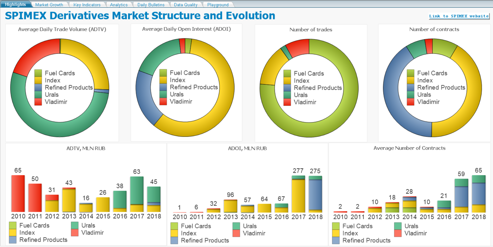

# Description
SPIMEX Derivatives Market is a simple tool to navigate [the first successfull Russian derivatives market](http://spimex.com/en/derivatives/market-portrait/). Using this tool you can explore the evolution of the market in real figures, following its twists and turns, and get insights about the current state of the market. Also, if you consider joining the market you can easily estimate the liquidity and volatility of each contract available on the market.

Building this tool in QlikView, we 
- provide a bird's-eye view of the current state and the history of the SPIMEX Derivatives Market
- facilitate the usage of publicly available market data
- replicate some GUI forms from the official website and improve their usability
- extract useful information from trade statistics, for example 
 - distribution of the settlement price calculation method
 - price evolution of the front month contract
 - FX rate history

## GUI Examples
### Highlights


### Market Growth


### Key Indicators


### Daily Bulletins


### Front Month Contract Price Evolution (Urals)


### Contract Volatility


### Settlement Price Distribution


## Data sources
The QlikView application uses only SPIMEX Daily Bulletins shared online on [the official website](http://spimex.com/en/derivatives/trades/results/) of the exchange. 


These files contain various market statistics on all active contracts and usually they are published every business day. Also, some aggregated statistics are available from the website, please visit [Key Indicators page](http://spimex.com/en/derivatives/indicators/).


### Format
SPIMEX Daily Bulletins are shared as Microsoft Excel files, one file per each trading day. Unfortunatelly, the interface provided by SPIMEX doesn't allow to download all the available data, so you can find yourself in a tedious process of downloading them one by one, but hopefully you don't have to, see the [Download files using Python](#download-files-using-python) section below. 

As of July 9, 2018 there're 763 files. The total number of files for more than 7.5 years could be significantly larger than that figure, but SPIMEX shares [the file](http://spimex.com/files/6488/fut_xls_20101217_20150601.xls), which combines all trading statistics from December 17, 2010 to June 1, 2015.

Columns of the current format are presented on the figure 
<p></p>

The format has been changed several times, so you have to be very carefull while parsing the website data, please follow the QlikView script `src/Load_BulletinSPIMEX.qvs` for details.

Once you uploaded data to the QlikView application, you can use the saved QVD file next time. Its usage helps to decrease significantly the execution time of the loading script. In order to use QVD file set 

```Bash
SET vETL.Source.Load = 'N';
```

If you wish to update data you need to reload all the data from Excel files. 

### Download files using Python
You can download data easily using the Python script `src/Download_BulletinSPIMEX.py`. Before running the script, please change the value of variables `start_date` and  `end_date` appropriately, see the script comments for more details. If you wish to export all available data since the market inception (i.e. since December 17, 2010), than the overall execution time could be about 20 minutes, so be patient, please.

### Data issues
While working with published data using you can encounter some data quality issues. These issues include:
 - wrong or non-consistent naming for several contracts and series of contracts
 - statistics on non-trading days
 - mistakes in values of changes of Open Interest or Settlement Prices, for example, Open Interest could change in the absence of any trade
 - taking into account non-anonymous (negotiated) trades while calculating of Volume Weighted Average Price (VWAP)

Most of the errors could be eliminated, once you recalculate some fields, for example, Open Interest, Settlement Price and VWAP can be recomputed using other available information. Once you decide to solve data issues automatically you should set
```Bash
SET vETL.Stage.CorrectErrors = 'Y';
```
in the Initialize tab of the QlikView loading script.

## Data model
We decyther additional information about the future contracts from their codes. For example, from the code `FDDL560MS78` we can extract the following information
- `F`: it's a future contract
- `D`: it's a deliverable contract (another option is a cash-settled contract)
- `DL5`: Summer Diesel should be delivered
- `60`: the lot size of the contract is 60 units
- `MS`: delivery hub is Moscow
- `7`: delivery month is July
- `8`: delivery year is 2018

That information helps us to differentiate one contracts from others.

Finally the following data model is used 
<p></p>
We use two fact tables: Instrument, which combines all trading statistics along with the information extracted from contract codes and FX rates, and Instrument Check, which marks each row from the Instrument table with Yes or No values on the predefined set of data validation rules. Also, two suplementary tables are introduced to support navigation, aggregation and selection process on the Date column.

# Author
Ilya Zlotnik, 2017-2018
